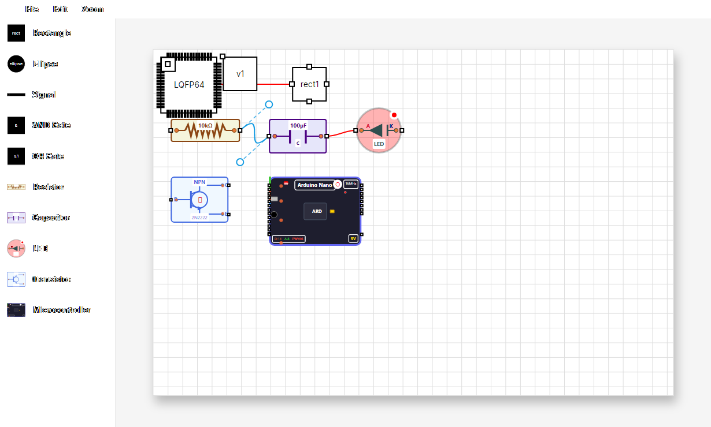

<div align="center">

# ⚡ NodePCB

### Next-Generation Curve-Driven PCB Trace Routing & Visual Circuit Graph Editor

[](https://dotnet.microsoft.com/)
[](https://avaloniaui.net/)
[](https://learn.microsoft.com/en-us/dotnet/csharp/)
[](https://github.com/roboter/NodePCB)
[](LICENSE.TXT)
[](tests/NodeEditorAvalonia.UnitTests)

<p align="center">
  <b>Reimagining PCB layout and electronic circuit editing through organic, low-impedance cubic Bezier curves instead of traditional rigid 90°/45° angles.</b>
</p>

[Key Features](#-key-features) • [Interactive Curves](#-interactive-bezier-curves) • [Component Library](#-electronic-components--footprints) • [Quick Start](#-quick-start) • [Architecture](#-project-architecture) • [Shortcuts](#-controls--shortcuts)

---

</div>

## 📖 Overview

Traditional Printed Circuit Board (PCB) design tools force traces into rigid 45° and 90° corners. In high-frequency, high-speed, RF, and flexible electronics, sharp trace corners introduce impedance discontinuities, signal reflections, and structural stress points.

**NodePCB** is a modern, GPU-accelerated node and circuit layout editor built on **Avalonia UI 11** and **.NET 10**. It treats PCB traces as **interactive, continuous cubic Bezier curves**, allowing engineers and makers to route connections with organic curvature, drag-and-drop control handles, and instant visual feedback.

Whether you are designing artistic PCBs, wearable flexible circuits, high-speed differential signal pairs, or node-based electronic schematics, NodePCB delivers an intuitive, cross-platform canvas with desktop and web support.

---

## 📸 Visual Showcase

### Interactive Bezier Curves & Tangent Handles
Select any trace to reveal draggable control handles ($P_1, P_2$) connected to trace endpoints ($P_0, P_3$) with dashed tangent guide lines for effortless curvature sculpting:

<div align="center">
  
</div>

### Real-Time Dynamic Routing
Smooth, organic trace routing in action:

<div align="center">
  
</div>

---

## ✨ Key Features

### 〰️ Interactive Bezier Curve Routing
- **Cubic Bezier Traces**: Smooth, continuous trace geometry between pins and vias.
- **Direct-Manipulation Control Handles**: Click and drag circular handles ($P_1$ and $P_2$) to reshape curves on the fly.
- **Tangent Guide Lines**: Dashed visual feedback lines ($P_0 \to P_1$ and $P_3 \to P_2$) show exact tangent vectors.
- **Clean Selection Highlighting**: Selected curves illuminate in vibrant cyan-blue (`#179DE3`) without distracting rectangular bounding boxes.
- **Handle Context Management**: Right-click context flyouts allow you to quickly reset handles, change orientation (Horizontal/Vertical), or customize curvature offset.

### 🔌 Electronic Components & Footprints
Pre-configured components and footprint templates ready for immediate placement:
- **Microcontrollers & ICs**: STM32 (LQFP-64 package with 64 routed pins), Arduino Nano with complete digital, analog, and power pinouts.
- **Passive Components**: Resistors, Capacitors ($100\mu\text{F}$), Inductors ($100\mu\text{H}$).
- **Semiconductors**: Diodes (1N4007), LEDs (multi-color), NPN Transistors (2N2222), Dual Op-Amps (LM358).
- **Interconnects & Hardware**: Vias, Test Pins, Multi-pin Headers (2-pin, 4-pin, etc.), 16 MHz Crystals, and Li-Ion Batteries.
- **Digital Logic Primitives**: AND gates, OR gates, and interactive Signal nodes with toggleable states.

### 🎯 Precision Canvas & Snapping Engine
- **Grid Snapping**: Configurable grid spacing and real-time pin alignment for millimeter-precise component placement.
- **Smooth Pan & Zoom**: Fluid canvas zoom from 25% to 400% with dedicated fit-to-canvas and reset shortcuts.
- **Toolbox & Palette**: Collapsible component toolbox for drag-and-drop node placement.
- **Marquee Multi-Selection**: Select, move, duplicate, cut, copy, and delete multiple components simultaneously.

### 🌐 Cross-Platform & Extensible
- **Avalonia UI 11**: Native performance on Windows, Linux, and macOS.
- **Browser-Ready (WebAssembly)**: Run directly in modern web browsers via .NET WASM tools.
- **MVVM Architecture**: Built with clean separation of concerns (`Model`, `Mvvm`, `View`) using `CommunityToolkit.Mvvm`.
- **JSON Serialization & Export**: Load and save layouts via `NodeSerializer` and export high-resolution drawings to PNG and vector formats.

---

## 🗂️ Project Architecture

The solution is divided into modular, decoupled libraries and sample applications:

```
NodePCB/
├── src/
│   ├── NodeEditorAvalonia/           # Core Avalonia controls, Bezier rendering, themes & behaviors
│   │   ├── Behaviors/               # Selection, drag, and handle manipulation behaviors
│   │   ├── Controls/                # Custom BezierConnector, Editor, and DrawingNode controls
│   │   └── Themes/                  # Fluent and Simple control templates and styles
│   ├── NodeEditorAvalonia.Model/     # Interfaces and abstractions (INode, IPin, IBezierConnector)
│   └── NodeEditorAvalonia.Mvvm/      # MVVM view models implementing CommunityToolkit.Mvvm
│
├── samples/
│   ├── NodeEditor.Base/             # Shared sample logic, component factory, export services
│   │   ├── Services/                # Demo layouts, NodeFactory, and ExportRenderer
│   │   └── ViewModels/              # Electronic component ViewModels (Resistor, IC, etc.)
│   ├── NodeEditor.Desktop/          # Desktop runner (Windows, Linux, macOS)
│   ├── NodeEditor.Web/              # WebAssembly (WASM) runner for in-browser execution
│   └── Sample/                      # Sample footprint schemas (e.g. LQFP64 STM32)
│
├── tests/
│   └── NodeEditorAvalonia.UnitTests/# Unit tests for geometry, models, and Bezier calculations
│
└── images/                          # Visual assets, screenshots, and animations
```

---

## ⌨️ Controls & Shortcuts

| Action | Mouse | Keyboard Shortcut |
| :--- | :--- | :--- |
| **Select Node / Curve** | `Left Click` | — |
| **Multi-Select** | `Ctrl + Click` or `Rubberband Box` | `Ctrl + A` (Select All) |
| **Deselect All** | `Left Click on Canvas` | `Escape` |
| **Move Node** | `Click & Drag Node` | Arrow Keys |
| **Bend Curve / Adjust Tangent** | `Click & Drag Control Handle` | — |
| **Reset / Configure Handle** | `Right Click on Curve` | — |
| **Pan Canvas** | `Middle Click & Drag` / `Alt + Drag` | — |
| **Zoom In / Zoom Out** | `Mouse Wheel` | `+` / `-` |
| **Reset Zoom (100%)** | — | `Ctrl + 0` or `Z` |
| **Fit to Canvas** | — | `Ctrl + 1` or `X` |
| **Cut / Copy / Paste** | — | `Ctrl + X` / `Ctrl + C` / `Ctrl + V` |
| **Duplicate Selected** | — | `Ctrl + D` |
| **Delete Selected** | — | `Delete` |
| **New / Open / Save** | — | `Ctrl + N` / `Ctrl + O` / `Ctrl + S` |

---

## 🚀 Quick Start

### Prerequisites
* [.NET 10.0 SDK](https://dotnet.microsoft.com/download/dotnet/10.0) or later installed.

### 1. Clone the Repository
```bash
git clone https://github.com/roboter/NodePCB.git
cd NodePCB
```

### 2. Build the Solution
```bash
dotnet build NodeEditor.sln
```

### 3. Run the Desktop Application
```bash
dotnet run --project samples/NodeEditor.Desktop/NodeEditor.Desktop.csproj
```

### 4. Run the Web (WASM) Application in Your Browser
```bash
dotnet workload install wasm-tools
dotnet run --project samples/NodeEditor.Web/NodeEditor.Web.csproj -c Release
```

### 5. Run Automated Tests
```bash
dotnet test
```

---

## 💻 Embedding NodePCB in Your Avalonia App

Integrating NodePCB into your existing Avalonia application is straightforward:

### 1. Add Namespace in XAML
```xml
<UserControl xmlns="https://github.com/avaloniaui"
             xmlns:x="http://schemas.microsoft.com/winfx/2006/xaml"
             xmlns:editor="clr-namespace:NodeEditor.Controls;assembly=NodeEditorAvalonia"
             x:Class="MyApp.Views.CircuitEditorView">

    <editor:Editor DataContext="{Binding Drawing}" />

</UserControl>
```

### 2. Initialize in ViewModel
```csharp
using NodeEditor.Mvvm;
using NodeEditor.Model;

public class CircuitEditorViewModel : ViewModelBase
{
    public IDrawingNode Drawing { get; }

    public CircuitEditorViewModel()
    {
        var factory = new DrawingNodeFactory();
        Drawing = factory.CreateDrawing();
        
        // Add nodes and connect them with smooth Bezier curves
        var node1 = factory.CreateNode(x: 100, y: 100, width: 80, height: 40);
        var node2 = factory.CreateNode(x: 350, y: 180, width: 80, height: 40);
        
        Drawing.Nodes.Add(node1);
        Drawing.Nodes.Add(node2);
        
        // Create an interactive Bezier curve connection
        var connector = factory.CreateConnector(node1.Pins[0], node2.Pins[0]);
        Drawing.Connectors.Add(connector);
    }
}
```

---

## 🗺️ Roadmap

- [x] Cubic Bezier curves with interactive control points ($P_1, P_2$)
- [x] Dashed handle lines and tangent visualization
- [x] Clean curve selection without rectangular highlight adorners
- [x] Context menu for handle reset and orientation toggling
- [ ] Export to industry-standard Gerber (RS-274X) & KiCad PCB layout files
- [ ] Design Rule Checks (DRC) for clearance between curved traces
- [ ] Symmetrical / smooth tangent handle constraint modes
- [ ] Differential pair routing with automatic curve length matching
- [ ] Auto-trace curving optimization from traditional orthogonal schematics

---

## 🤝 Contributing

Contributions, feature requests, and bug reports are welcome!
Feel free to open an issue or submit a Pull Request on [GitHub](https://github.com/roboter/NodePCB).

---

## 📄 License

NodePCB is open-source software licensed under the [MIT License](LICENSE.TXT).
